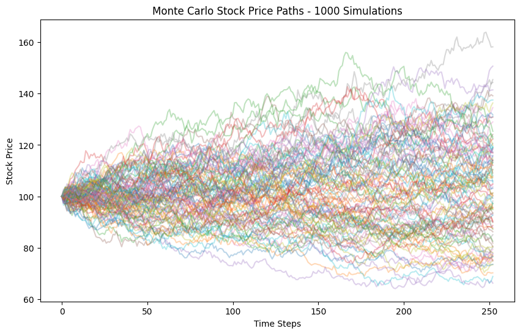
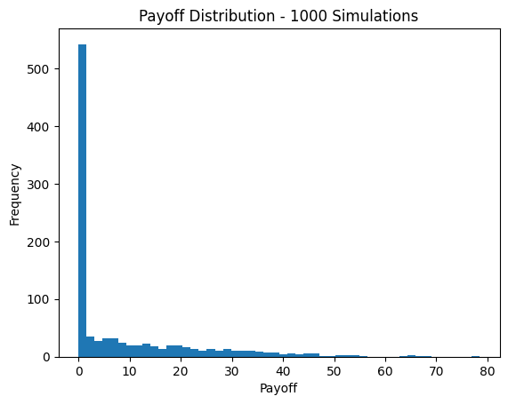
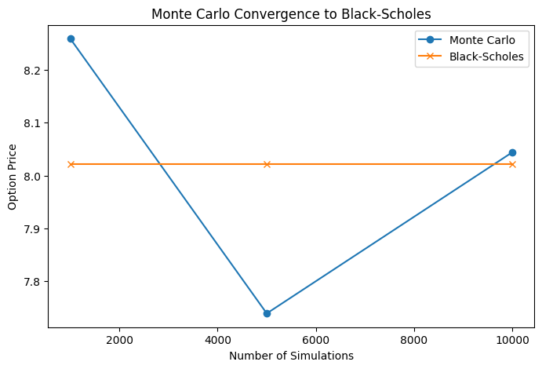
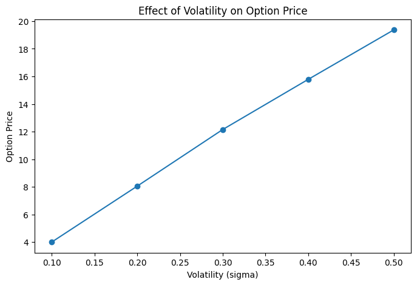

# Monte Carlo Option Pricing

This project uses Monte Carlo simulation to estimate the price of a European call option and compares the results with the Black-Scholes model.

# Project Overview

- Monte Carlo simulation (1000, 5000, 10000)
- Black-Scholes comparison
- Payoff distribution analysis
- Volatility sensitivity analysis

- # Example Outputs

# Monte Carlo Paths

# Payoff Distribution

# Convergence

# Volatility Analysis

# Technologies
- Python
- NumPy
- Matplotlib
- SciPy

# 📂 Additional Visualizations
More graphs are available in the `images/` folder.

# Conclusion
This project implemented Monte Carlo simulation to estimate the price of a European call option. The stock price was modeled using Geometric Brownian Motion, and the option payoff was calculated at maturity.

The results were compared with the Black-Scholes analytical solution. The comparison showed that Monte Carlo simulation can approximate the theoretical option price, especially when the number of simulations is increased.

Additionally, a sensitivity analysis on volatility was conducted. The results showed that as volatility increases, the option price also increases. This is because higher volatility leads to greater uncertainty in future stock prices, increasing the likelihood of higher payoffs.

This project demonstrates the use of simulation, probability, and financial modeling in quantitative finance.
